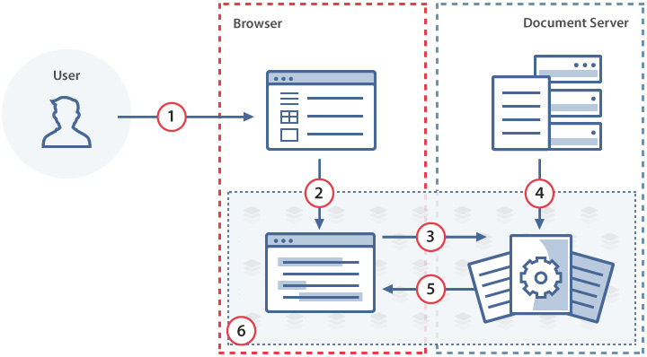
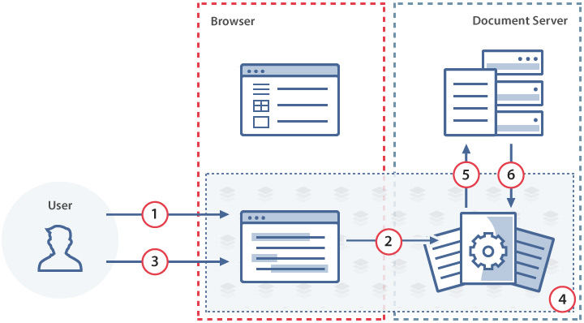
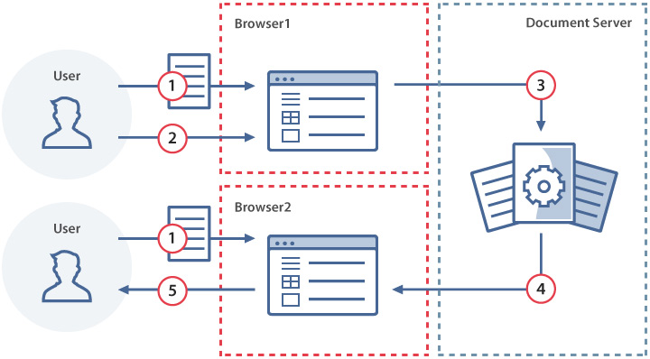

::: tip 额外知识
 ONLYOFFICE Docs 是一款免费的协作在线办公套件,包括文本、电子表格和演示文稿、表单和 PDF 的查看器和编辑器，与 Office Open XML 格式完全兼容：.docx、.xlsx、.pptx，并支持实时协作编辑。
:::

# ONLYOFFICE工作原理

<!-- URL Source: https://open.nezha.org.cn/guide/works.html -->

## 打开文件

1. 用户使用文档管理器打开文档进行查看或者编辑。（基于浏览器访问）
2. 使用JavaScript API 将文档唯一标识符（key）以及文档URL（url）发送到文档编辑器。
3. 文档编辑器向文档编辑服务发送一个打开文档的请求。
4. 文档编辑服务从文档存储服务下载相对应的文档，并将文档转换为Office Open XML格式。
5. 准备就绪后，文档编辑服务会将转化后的文档传输到基于浏览器的文档编辑器。
6. 提供编辑或者查看权限，对文档进行相应操作，执行保存。

## 保存文件

1. 用户在文档编辑器中编辑文件。
2. 文档编辑器将更改发送给文档编辑服务。
3. 用户关闭文档编辑器或触发手动保存。
4. 文档编辑服务监视到文档结束工作，并收集从文档编辑器发送到一个文档中的更改
5. 执行回调保存接口
6. 返回状态

## 协同编辑

1. 用户1和用户2在文档编辑器中打开同一个文档，即打开文件时已使用一个相同的document.key
2. 用户1对打开的文档进行更改。
3. 文档编辑器将用户1所做的更改发送到文档编辑服务。
4. 文档编辑服务将用户1所做的更改发送给用户2文档编辑器。
5. 现在用户2可以看到这些变化。
