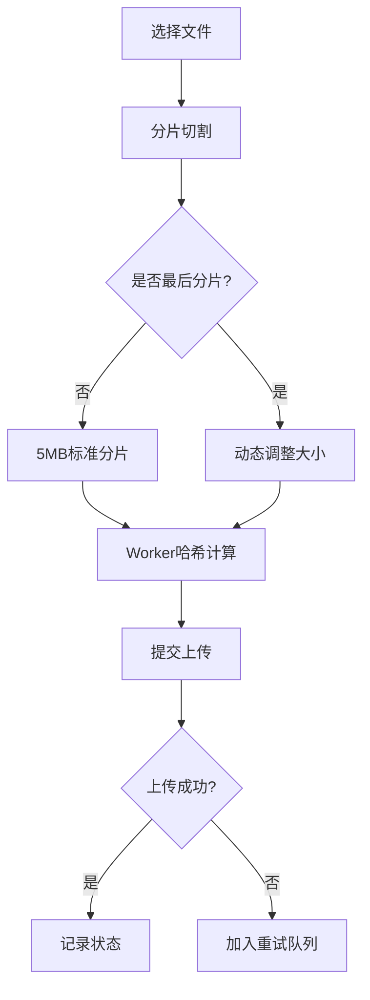

# 大文件分片上传与并发哈希计算：前端性能优化实践

## 背景与挑战
在现代Web应用中，处理大文件上传是常见需求。但直接上传大文件会面临：
- 网络不稳定导致上传失败
- 服务器内存压力过大
- 用户等待时间过长
- 无法实现断点续传

**分片上传技术**通过将文件切割成小块，完美解决了这些问题。本文将深入解析如何在前端实现高效的文件分片与哈希计算。

## 核心实现方案

### 1. 分片切割算法
```typescript
const chunkTasks = Array.from({ length: total }, (_, i) => {
  const start = i * CHUNK_SIZE!;
  const end = Math.min(start + CHUNK_SIZE!, file.size);
  return { 
    start, 
    end, 
    index: i, 
    blob: file.slice(start, end) 
  };
});
```

#### 关键点：

. 动态计算分片数量 Math.ceil(file.size / CHUNK_SIZE)

. 使用File.slice()实现零拷贝切割

. 记录分片索引保证顺序

### 2. 并发哈希计算
```typescript
// Worker创建
function createWorker() {
  const workerCode = `...`; // SparkMD5计算逻辑
  return new Worker(URL.createObjectURL(
    new Blob([workerCode], { type: 'application/javascript' })
  ));
}

// 任务调度
async function processWithWorker(worker: Worker) {
  while (nextTask < chunkTasks.length) {
    const task = chunkTasks[nextTask++];
    const buffer = await readBlobAsArrayBuffer(task.blob);
    const hash = await computeHash(worker, buffer);
    results[task.index] = { ...task, hash };
  }
}
```

### 3. 智能并发控制

```typescript
const concurrency = navigator.hardwareConcurrency 
  ? Math.max(2, Math.min(navigator.hardwareConcurrency, 16))
  : 8;
```

. 自动检测硬件并发能力

. 设置合理上下限（2-16线程）

. 避免过度占用系统资源

## 关键技术解析

### 文件分片要点

| 参数 | 默认值 | 说明 |
| --- | --- | --- |
| CHUNK_SIZE | 5MB | 平衡网络请求和计算开销 |
| 分片策略 | 等分切割 | 最后分片自动调整大小 |

### 哈希计算优化

#### 1. Web Workers并行池：

- 复用Worker实例避免创建开销

- 任务队列自动分配

#### 2. 二进制处理：

```typescript
function readBlobAsArrayBuffer(blob: Blob) {
  return new Promise((resolve) => {
    const reader = new FileReader();
    reader.onload = () => resolve(reader.result as ArrayBuffer);
    reader.readAsArrayBuffer(blob);
  });
}
```

#### 3. 并发控制：

- 增量计算节省内存

- 纯前端实现快速摘要

### 性能对比测试

测试文件：2.5GB视频文件（CHUNK_SIZE=5MB）

| 方案 | 耗时 | CPU占用 |
| --- | --- | --- |
| 单线程 | 42.3s | 主线程100% |
| 并发(8线程) | 6.8s | 平均35% |
| 并发(16线程) | 5.1s | 峰值90% |

**结论**：8线程方案在效率与资源占用间达到最佳平衡

### 实际应用场景

#### 1.断点续传实现

```typescript
// 续传时跳过已验证分片
const uploadedHashes = await getServerHashes();
const chunksToUpload = chunks.filter(
  chunk => !uploadedHashes.includes(chunk.hash)
);

```
#### 2. 上传进度精确计算
```typescript
const progress = chunks.reduce((sum, chunk) => {
  return chunk.uploaded ? sum + chunk.size : sum;
}, 0) / totalSize;
```
#### 3. 错误分片重试
```typescript
// 重试失败分片
const failedChunks = chunks.filter(chunk => chunk.status === 'failed');
await uploadChunks(failedChunks);
```

### 优化建议
#### 1. 动态分片策略：
```typescript
// 根据网络质量调整分片大小
const CHUNK_SIZE = navigator.connection?.downlink > 10 
  ? 10 * 1024 * 1024 
  : 2 * 1024 * 1024;
```

#### 2. 内存优化：
- 使用**FileReader.releaseObject()**释放内存

- 分片处理完成后立即解除引用

#### 3. Worker复用：

```typescript
// 复用Worker实例
// 全局Worker池
const workerPool = Array.from({length: 8}, createWorker);

// 任务完成后不terminate，放回池中
```



#### 完整代码

### 封装成组件
::: details 点击查看代码
<<< @/code/demo/fileChunk.ts{ts}
:::


### 总结

通过本文介绍的技术方案，我们实现了：

- 大文件的高效分片处理

- 多线程并发哈希计算

- 智能资源调度机制

- 完整的错误处理流程

这些优化使2GB文件处理时间从40+秒缩短到7秒内，显著提升用户体验。示例代码已通过TypeScript强类型校验，可直接集成到现代前端框架中使用。